# The German Traffic Sign Recognition Benchmark


```python
# importing the required packages

import numpy as np
import matplotlib.pyplot as plt
import os, glob
import pickle
import pandas as pd
import csv
import cv2
import imutils
from PIL import Image
from skimage import exposure, feature, transform
%matplotlib inline

# classification required packages

from sklearn.neural_network import MLPClassifier
from sklearn.model_selection import cross_val_score, train_test_split
from sklearn.metrics import classification_report
from sklearn.externals import joblib

import PIL
from PIL import ImageFont
from PIL import Image
from PIL import ImageDraw

import warnings
warnings.filterwarnings("ignore", category=DeprecationWarning)
%matplotlib inline
```

## Helper Functions


```python
# helper functions 

# function for reading the images
# arguments: path to the traffic sign data, for example '../../GTSRB/train/Final_Training/Images/'
# returns: list of images, list of corresponding labels 
def readTrafficSigns(rootpath):
    '''Reads traffic sign data for German Traffic Sign Recognition Benchmark.

    Arguments: path to the traffic sign data, for example '../dataset/GTSRB/train/Final_Training/Images/'
    Returns:   list of images, list of corresponding labels'''
    images = [] # images
    labels = [] # corresponding labels
    # loop over all 42 classes
    for c in range(0,43):
        prefix = rootpath + '/' + format(c, '05d') + '/' # subdirectory for class
        gtFile = open(prefix + 'GT-'+ format(c, '05d') + '.csv') # annotations file
        gtReader = csv.reader(gtFile, delimiter=';') # csv parser for annotations file
        gtReader.next() # skip header
        # loop over all images in current annotations file
        for row in gtReader:
            images.append(plt.imread(prefix + row[0])) # the 1th column is the filename
            labels.append(row[7]) # the 8th column is the label
        gtFile.close()
    return images, labels


def rgb2gray(rgb):

    r, g, b = rgb[:,:,0], rgb[:,:,1], rgb[:,:,2]
    gray = 0.2989 * r + 0.5870 * g + 0.1140 * b

    return gray

def get_csv(path):
    return [os.path.join(path,f) for f in os.listdir(path) if f.endswith('.csv')]


def showimg_n_hog(grayimg,hogImage):
    
    fig, (ax1, ax2) = plt.subplots(1, 2, figsize=(8, 4), sharex=True, sharey=True)

    ax1.axis('off')
    ax1.imshow(grayimg)
    ax1.set_title('Input image')
    ax1.set_adjustable('box-forced')

    ax2.axis('off')
    ax2.imshow(hogImage, cmap=plt.cm.gray)
    ax2.set_title('Histogram of Oriented Gradients')
    ax1.set_adjustable('box-forced')
    plt.show()
    
# Functions for testimages    
testpath="../dataset/GTSRB/test/Final_Test/Images/"
def loadtestimages_from_path(testpath):
    print("[INFO] reading all test images from directory\n")
    gtFile = get_csv(testpath)
    filename = gtFile[0]
    raw_data = open(filename, 'rt')
    reader = csv.reader(raw_data, delimiter=';', quoting=csv.QUOTE_NONE)
    reader.next()
    testfiles = list(reader)
    timg = []
    testimg = []
#     tlbl = []
    for i in testfiles:
    #     print (i[0],i[-1])
        fname = os.path.join(testpath,i[0])
        timg.append(fname)
        tim = plt.imread(fname)
        testimg.append(tim)
#         label = i[-1]
#         tlbl.append(label)
    np.save("Image_n_Labels/testimagenames.npy",timg)
    np.save("Image_n_Labels/testimages.npy",testimg)
#     np.save("Image_n_Labels/testimagelabels.npy",tlbl)
    return timg,testimg
    
def loadtestimages_from_npy():
    print("[INFO] loading from .npy\n")
    timg = np.load("Image_n_Labels/testimagenames.npy")
    testimg = np.load("Image_n_Labels/testimages.npy")
#     tlbl = np.load("Image_n_Labels/testimagelabels.npy")
    return timg,testimg
```

## load training images


```python
if os.path.isfile("Image_n_Labels/trainImages.npy") &  os.path.isfile("Image_n_Labels/trainLabels.npy") :
    X = np.load("Image_n_Labels/trainImages.npy")
    y = np.load("Image_n_Labels/trainLabels.npy")
    print("[INFO] Training images and labels are loaded in variables ==> X,y")
    print("[INFO] Number of training Images {} \nNumber of Labels {}".format(len(X), len(y)))
else:    
    # training images and labels
    trainImages, trainLabels = readTrafficSigns('../dataset/GTSRB/train/Final_Training/Images/')
    np.save("Image_n_Labels/trainImages.npy",trainImages)
    np.save("Image_n_Labels/trainLabels.npy",trainLabels)
    print("[INFO] training images and labels are read from the dataset directory")
    print("[INFO] training images saved to Image_n_Labels/trainingImages.npy for further use")
    print("[INFO] training labels saved to Image_n_Labels/trainingLabels.npy for further use")
```

    [INFO] Training images and labels are loaded in variables ==> X,y
    [INFO] Number of training Images 39209 
    Number of Labels 39209


## load test images


```python
if (os.path.isfile("Image_n_Labels/testimagenames.npy") &  os.path.isfile("Image_n_Labels/testimages.npy")):
    timg,testimg = loadtestimages_from_npy()
else:
    timg,testimg = loadtestimages_from_path(testpath)
```


```python
print("There are total {} test images availabe".format(len(timg)))
print("Example {}".format(timg[12629]))
plt.imshow(plt.imread(timg[0]))
```

    There are total 12630 test images availabe
    Example ../dataset/GTSRB/test/Final_Test/Images/12629.ppm


    <matplotlib.image.AxesImage at 0x7ff5ec9e3dd0>


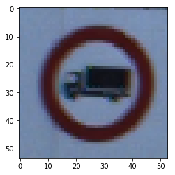


```python
y.astype("float")
```


    array([  0.,   0.,   0., ...,  42.,  42.,  42.])


```python
# simple test on single image for HoG features
n = np.random.randint(0,len(X))
i1 = X[n]
grayim = rgb2gray(i1)
gI1 = transform.resize(grayim,(40,40))
# gI2 = cv2.resize(grayim, (40, 40), interpolation = cv2.INTER_CUBIC)
(H, hogImage) = feature.hog(gI1, orientations=9, pixels_per_cell=(8,8),
    cells_per_block=(2, 2), transform_sqrt=True, visualise=True)
hogImage = exposure.rescale_intensity(hogImage, out_range=(0, 255)).astype("uint8")

showimg_n_hog(gI1, hogImage)
print(len(H))
```


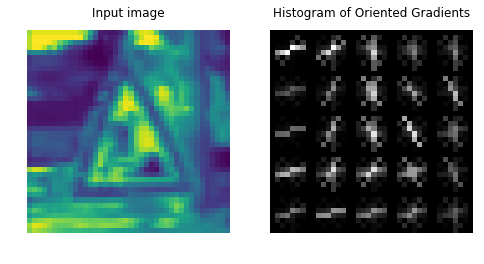


    576


## Extract HoG features over all training images 


```python
if os.path.isfile("HoGFeatures/HoGfeatures.npy") & os.path.isfile("HoGFeatures/HoGvisualize.npy") :
    print("loading from file ... ")
    hogfeat = np.load("HoGFeatures/HoGfeatures.npy")
    hogviz = np.load("HoGFeatures/HoGvisualize.npy")
    
    print("HoG features are loaded from HoGfeatures.npy to variable ==> hogfeat")
    print("HoG visualizations are loaded from HoGvisualize.npy to variable ==> hogviz")
else:
    print("HoGfeatures.npy does not found")
    Hviz = []
    Hfeat = []
    for i in range(0,len(X)):
        # show an update every 1,000 images
        if i > 0 and i % 1000 == 0:
            print("[INFO] processed {}/{}".format(i, len(X)))
        I = X[i]
        grayim = rgb2gray(I)
        grayim = transform.resize(grayim,(40,40))

        (H_4x4, hogImage) = feature.hog(grayim, orientations=9, pixels_per_cell=(4, 4),
            cells_per_block=(2, 2), transform_sqrt=True, visualise=True)
        hogImage = exposure.rescale_intensity(hogImage, out_range=(0, 255)).astype("uint8")
#         hogImage = hogImage.astype("uint8")
        Hviz.append(hogImage)
        Hfeat.append(H_4x4)
        # save the features using numpy save with .npy extention 
        # which reduced the storage space by 4times compared to pickle
    np.save("HoGFeatures/HoGfeatures.npy", Hfeat)
    np.save("HoGFeatures/HoGvisualize.npy", Hviz)
    print("HoGfeatures.npy are saved")  
    print("HoGvisualize.npy are saved")
```

    loading from file ... 
    HoG features are loaded from HoGfeatures.npy to variable ==> hogfeat
    HoG visualizations are loaded from HoGvisualize.npy to variable ==> hogviz


## Extract HoG features over all testing images 


```python
if os.path.isfile("HoGFeatures/HoGfeatures_test.npy") & os.path.isfile("HoGFeatures/HoGvisualize_test.npy") :
    hogfeat_test = np.load("HoGFeatures/HoGfeatures_test.npy")
    hogviz_test = np.load("HoGFeatures/HoGvisualize_test.npy")
    
    print("HoG features are loaded from HoGfeatures_test.npy to variable ==> hogfeat_test")
    print("HoG visualizations are loaded from HoGvisualize_test.npy to variable ==> hogviz_test")
else:
    print("HoGfeatures_test.npy does not found")
    Hviz = []
    Hfeat = []
    for i in range(0,len(X)):
        # show an update every 1,000 images
        if i > 0 and i % 1000 == 0:
            print("[INFO] processed {}/{}".format(i, len(X)))
        I = X[i]
        grayim = rgb2gray(I)
        grayim = transform.resize(grayim,(40,40))

        (H_4x4, hogImage) = feature.hog(grayim, orientations=9, pixels_per_cell=(4, 4),
            cells_per_block=(2, 2), transform_sqrt=True, visualise=True)
        hogImage = exposure.rescale_intensity(hogImage, out_range=(0, 255)).astype("uint8")
    #         hogImage = hogImage.astype("uint8")
        Hviz.append(hogImage)
        Hfeat.append(H_4x4)
        # save the features using numpy save with .npy extention 
        # which reduced the storage space by 4times compared to pickle
    np.save("HoGFeatures/HoGfeatures_test.npy", Hfeat)
    np.save("HoGFeatures/HoGvisualize_test.npy", Hviz)
    print("HoGfeatures_test.npy are saved")  
    print("HoGvisualize_test.npy are saved")
```

    HoG features are loaded from HoGfeatures_test.npy to variable ==> hogfeat_test
    HoG visualizations are loaded from HoGvisualize_test.npy to variable ==> hogviz_test


## converting datatype to float: training data


```python
Xhog = np.array(hogfeat).astype("float")
y = y.astype("float")
print(Xhog.shape,y.shape)
print(np.unique(y))
```

    ((39209, 2916), (39209,))
    [  0.   1.   2.   3.   4.   5.   6.   7.   8.   9.  10.  11.  12.  13.  14.
      15.  16.  17.  18.  19.  20.  21.  22.  23.  24.  25.  26.  27.  28.  29.
      30.  31.  32.  33.  34.  35.  36.  37.  38.  39.  40.  41.  42.]


## converting datatype to float: test data


```python
X_t = np.array(hogfeat_test).astype("float")
print(X_t.shape)
```

    (12630, 2916)


```python
X_hog = pd.DataFrame(Xhog)
```


```python
X_hog.head()
```


<div>
<table border="1" class="dataframe">
  <thead>
    <tr style="text-align: right;">
      <th></th>
      <th>0</th>
      <th>1</th>
      <th>2</th>
      <th>3</th>
      <th>4</th>
      <th>5</th>
      <th>6</th>
      <th>7</th>
      <th>8</th>
      <th>9</th>
      <th>...</th>
      <th>2906</th>
      <th>2907</th>
      <th>2908</th>
      <th>2909</th>
      <th>2910</th>
      <th>2911</th>
      <th>2912</th>
      <th>2913</th>
      <th>2914</th>
      <th>2915</th>
    </tr>
  </thead>
  <tbody>
    <tr>
      <th>0</th>
      <td>0.072230</td>
      <td>0.033674</td>
      <td>0.014052</td>
      <td>0.012905</td>
      <td>0.008588</td>
      <td>0.0</td>
      <td>0.0</td>
      <td>0.000000</td>
      <td>0.014921</td>
      <td>0.087632</td>
      <td>...</td>
      <td>0.000000</td>
      <td>0.050807</td>
      <td>0.022688</td>
      <td>0.039415</td>
      <td>0.083773</td>
      <td>0.062538</td>
      <td>0.029324</td>
      <td>0.000000</td>
      <td>0.050438</td>
      <td>0.000000</td>
    </tr>
    <tr>
      <th>1</th>
      <td>0.032179</td>
      <td>0.000000</td>
      <td>0.009637</td>
      <td>0.013536</td>
      <td>0.000000</td>
      <td>0.0</td>
      <td>0.0</td>
      <td>0.010108</td>
      <td>0.052713</td>
      <td>0.075905</td>
      <td>...</td>
      <td>0.120012</td>
      <td>0.089115</td>
      <td>0.026171</td>
      <td>0.012772</td>
      <td>0.024310</td>
      <td>0.087584</td>
      <td>0.000000</td>
      <td>0.005514</td>
      <td>0.034753</td>
      <td>0.040569</td>
    </tr>
    <tr>
      <th>2</th>
      <td>0.121812</td>
      <td>0.031105</td>
      <td>0.039984</td>
      <td>0.000000</td>
      <td>0.000000</td>
      <td>0.0</td>
      <td>0.0</td>
      <td>0.000000</td>
      <td>0.012812</td>
      <td>0.100121</td>
      <td>...</td>
      <td>0.131397</td>
      <td>0.049028</td>
      <td>0.000000</td>
      <td>0.000000</td>
      <td>0.000960</td>
      <td>0.058873</td>
      <td>0.000000</td>
      <td>0.030014</td>
      <td>0.066235</td>
      <td>0.000000</td>
    </tr>
    <tr>
      <th>3</th>
      <td>0.094488</td>
      <td>0.131136</td>
      <td>0.000000</td>
      <td>0.000000</td>
      <td>0.000000</td>
      <td>0.0</td>
      <td>0.0</td>
      <td>0.000000</td>
      <td>0.000000</td>
      <td>0.133118</td>
      <td>...</td>
      <td>0.129733</td>
      <td>0.038213</td>
      <td>0.000000</td>
      <td>0.000000</td>
      <td>0.014868</td>
      <td>0.025527</td>
      <td>0.000000</td>
      <td>0.027597</td>
      <td>0.032608</td>
      <td>0.012159</td>
    </tr>
    <tr>
      <th>4</th>
      <td>0.039229</td>
      <td>0.117052</td>
      <td>0.009980</td>
      <td>0.000000</td>
      <td>0.000601</td>
      <td>0.0</td>
      <td>0.0</td>
      <td>0.000000</td>
      <td>0.011472</td>
      <td>0.058563</td>
      <td>...</td>
      <td>0.051272</td>
      <td>0.068669</td>
      <td>0.020195</td>
      <td>0.000000</td>
      <td>0.040250</td>
      <td>0.028077</td>
      <td>0.000000</td>
      <td>0.000000</td>
      <td>0.050481</td>
      <td>0.032100</td>
    </tr>
  </tbody>
</table>
<p>5 rows × 2916 columns</p>
</div>


```python
Xt_hog = pd.DataFrame(X_t)
Xt_hog.tail()

```


<div>
<table border="1" class="dataframe">
  <thead>
    <tr style="text-align: right;">
      <th></th>
      <th>0</th>
      <th>1</th>
      <th>2</th>
      <th>3</th>
      <th>4</th>
      <th>5</th>
      <th>6</th>
      <th>7</th>
      <th>8</th>
      <th>9</th>
      <th>...</th>
      <th>2906</th>
      <th>2907</th>
      <th>2908</th>
      <th>2909</th>
      <th>2910</th>
      <th>2911</th>
      <th>2912</th>
      <th>2913</th>
      <th>2914</th>
      <th>2915</th>
    </tr>
  </thead>
  <tbody>
    <tr>
      <th>12625</th>
      <td>0.077456</td>
      <td>0.021332</td>
      <td>0.077131</td>
      <td>0.053629</td>
      <td>0.086382</td>
      <td>0.000000</td>
      <td>0.000000</td>
      <td>0.000000</td>
      <td>0.003836</td>
      <td>0.069898</td>
      <td>...</td>
      <td>0.030939</td>
      <td>0.122161</td>
      <td>0.000000</td>
      <td>0.035191</td>
      <td>0.055457</td>
      <td>0.035819</td>
      <td>0.040360</td>
      <td>0.114481</td>
      <td>0.013713</td>
      <td>0.012215</td>
    </tr>
    <tr>
      <th>12626</th>
      <td>0.039531</td>
      <td>0.012652</td>
      <td>0.157713</td>
      <td>0.020080</td>
      <td>0.032364</td>
      <td>0.000000</td>
      <td>0.000000</td>
      <td>0.000960</td>
      <td>0.000000</td>
      <td>0.125118</td>
      <td>...</td>
      <td>0.000000</td>
      <td>0.035144</td>
      <td>0.025385</td>
      <td>0.006044</td>
      <td>0.012795</td>
      <td>0.028675</td>
      <td>0.010273</td>
      <td>0.000000</td>
      <td>0.000000</td>
      <td>0.004640</td>
    </tr>
    <tr>
      <th>12627</th>
      <td>0.028590</td>
      <td>0.018664</td>
      <td>0.065121</td>
      <td>0.024937</td>
      <td>0.130718</td>
      <td>0.000000</td>
      <td>0.000000</td>
      <td>0.028223</td>
      <td>0.035795</td>
      <td>0.015608</td>
      <td>...</td>
      <td>0.021922</td>
      <td>0.092965</td>
      <td>0.000000</td>
      <td>0.035935</td>
      <td>0.000000</td>
      <td>0.033950</td>
      <td>0.056011</td>
      <td>0.000000</td>
      <td>0.010660</td>
      <td>0.064340</td>
    </tr>
    <tr>
      <th>12628</th>
      <td>0.027729</td>
      <td>0.002800</td>
      <td>0.000000</td>
      <td>0.000000</td>
      <td>0.043393</td>
      <td>0.034292</td>
      <td>0.018724</td>
      <td>0.017540</td>
      <td>0.000000</td>
      <td>0.064669</td>
      <td>...</td>
      <td>0.020043</td>
      <td>0.092382</td>
      <td>0.000000</td>
      <td>0.009313</td>
      <td>0.000000</td>
      <td>0.016396</td>
      <td>0.000000</td>
      <td>0.006640</td>
      <td>0.053852</td>
      <td>0.011477</td>
    </tr>
    <tr>
      <th>12629</th>
      <td>0.057895</td>
      <td>0.012640</td>
      <td>0.000000</td>
      <td>0.023053</td>
      <td>0.053999</td>
      <td>0.016823</td>
      <td>0.000000</td>
      <td>0.025690</td>
      <td>0.000000</td>
      <td>0.088298</td>
      <td>...</td>
      <td>0.018421</td>
      <td>0.016075</td>
      <td>0.000000</td>
      <td>0.044859</td>
      <td>0.000000</td>
      <td>0.102885</td>
      <td>0.016367</td>
      <td>0.043738</td>
      <td>0.018543</td>
      <td>0.000000</td>
    </tr>
  </tbody>
</table>
<p>5 rows × 2916 columns</p>
</div>


```python
for i in range(0,len(np.unique(y))):
    yi = np.where(y==i)
#     print("label: {}  \n indices: {} ".format(i,yi))
```


```python
features = Xhog
labels = y
Xtest = X_t

# take the  data and construct the training and testing split, using 75% of the
# data for training and 25% for testing
(trainData, testData, trainLabels, testLabels) = train_test_split(features,
    labels, test_size=0.25, random_state=42)
 
# now, let's take 10% of the training data and use that for validation
(trainData, valData, trainLabels, valLabels) = train_test_split(trainData, trainLabels,
    test_size=0.1, random_state=84)
 
# show the sizes of each data split
print("training data points: {}".format(len(trainLabels)))
print("validation data points: {}".format(len(valLabels)))
print("testing data points: {}".format(len(testLabels)))
```

    training data points: 26465
    validation data points: 2941
    testing data points: 9803


## Multi-layer Perceptron 


```python
# MLP
if os.path.isfile("clf/clf_mlp_hog.pkl"):
    print("[INFO] loading classifier: MLP =200 trained on HoG features...")
    mlp= joblib.load("clf/clf_mlp_hog.pkl")
    print("[INFO] Classifer is loaded as instance ::mlp::")
else:
    print("[INFO] pre-trained classifier not found. \n Training Classifier \MLP = 200")
    mlp = MLPClassifier(hidden_layer_sizes=(200,))
    mlp.fit(trainData,trainLabels)
    print("[INFO] Succefully trained the classsifier. \n Saving the classifier for further use")
    joblib.dump(mlp, 'clf/clf_mlp_hog.pkl') 
    print("[INFO] Classifier Saved")

```

    [INFO] loading classifier: MLP =200 trained on HoG features...
    [INFO] Classifer is loaded as instance ::mlp::


```python
print("accuracy on training data: {}".format(mlp.score(trainData,trainLabels)))
```

    accuracy on training data: 1.0


```python
print("accuracy on test data: {}".format(mlp.score(testData,testLabels)))
```

    accuracy on test data: 0.975925737019


```python
print("accuracy on validation data: {}".format(mlp.score(valData,valLabels)))
```

    accuracy on validation data: 0.973478408705


### cross validation accuracy


```python
cv_score = cross_val_score(mlp,testData,testLabels,cv=5)
print("mean cross-validation score: {}".format(np.mean(cv_score)))
```

    mean cross-validation score: 0.95877682288


```python
mlp.predict(testData[8000])
```

    /home/shravankumar/anaconda2/lib/python2.7/site-packages/sklearn/utils/validation.py:395: DeprecationWarning: Passing 1d arrays as data is deprecated in 0.17 and will raise ValueError in 0.19. Reshape your data either using X.reshape(-1, 1) if your data has a single feature or X.reshape(1, -1) if it contains a single sample.
      DeprecationWarning)


    array([ 25.])


```python
y_pred = mlp.predict(Xtest)
```


```python
y_pred
```


    array([ 16.,   1.,  38., ...,   3.,   7.,  10.])


```python
import csv
with open('submission.csv', "wb") as csv_file:
        writer = csv.writer(csv_file, delimiter=';')
        for line in zip(timg,y_pred):
            writer.writerow(line)
```

### final classification report


```python
predictions = mlp.predict(testData)
 
# show a final classification report demonstrating the accuracy of the classifier
print("EVALUATION ON TESTING DATA")
print(classification_report(testLabels, predictions))
```

    EVALUATION ON TESTING DATA
                 precision    recall  f1-score   support
    
            0.0       0.98      0.95      0.97        44
            1.0       0.93      0.96      0.95       594
            2.0       0.94      0.90      0.92       560
            3.0       0.96      0.96      0.96       348
            4.0       0.98      0.98      0.98       529
            5.0       0.89      0.89      0.89       462
            6.0       1.00      0.99      0.99        81
            7.0       0.93      0.96      0.94       336
            8.0       0.96      0.94      0.95       385
            9.0       1.00      0.99      1.00       359
           10.0       0.99      0.99      0.99       461
           11.0       0.99      1.00      0.99       291
           12.0       0.99      1.00      1.00       548
           13.0       1.00      1.00      1.00       549
           14.0       0.99      0.99      0.99       197
           15.0       0.99      0.99      0.99       152
           16.0       1.00      1.00      1.00       108
           17.0       1.00      1.00      1.00       286
           18.0       0.99      0.99      0.99       288
           19.0       1.00      1.00      1.00        53
           20.0       1.00      0.93      0.97        90
           21.0       1.00      1.00      1.00        82
           22.0       1.00      1.00      1.00       107
           23.0       1.00      0.99      1.00       138
           24.0       1.00      0.99      0.99        68
           25.0       0.99      0.99      0.99       369
           26.0       0.99      0.97      0.98       152
           27.0       0.95      0.98      0.97        60
           28.0       0.99      0.99      0.99       129
           29.0       0.97      0.97      0.97        77
           30.0       0.97      1.00      0.98       118
           31.0       1.00      1.00      1.00       201
           32.0       1.00      1.00      1.00        48
           33.0       0.99      0.99      0.99       182
           34.0       1.00      0.97      0.99       117
           35.0       1.00      0.99      0.99       290
           36.0       1.00      0.98      0.99       105
           37.0       1.00      1.00      1.00        60
           38.0       1.00      1.00      1.00       517
           39.0       1.00      1.00      1.00        69
           40.0       0.97      0.99      0.98        77
           41.0       1.00      1.00      1.00        60
           42.0       1.00      1.00      1.00        56
    
    avg / total       0.98      0.98      0.98      9803
    


### Testing on random images


```python
def testing_on_data():
    n = np.random.randint(0, high=len(testLabels))
    test1 =X[n]
    t1_true = y[n]

    plt.imshow(test1)
    plt.show()    

    grayim = rgb2gray(test1)
    grayim = transform.resize(grayim,(40,40))

    (t1_feat, hogImage) = feature.hog(grayim, orientations=9, pixels_per_cell=(4, 4),
        cells_per_block=(2, 2), transform_sqrt=True, visualise=True)

    t1_feat.shape
    t1_predict = mlp.predict(t1_feat)
    print("==========")
    print("True :{}\npredicted:{}\n".format(t1_true,t1_predict[0]))
    # show the prediction
    print("I think that belongs to class: {}".format(t1_predict[0]))
    print("==========")
    font = ImageFont.truetype("/usr/share/fonts/dejavu/DejaVuSans.ttf", 10)
    img = Image.fromarray(test1)
    draw = ImageDraw.Draw(img)
    draw.text((0,0), str(t1_predict), (0,255,0), font=font)
    draw = ImageDraw.Draw(img)
    plt.show(img) 
```


```python
for i in range(10):
    testing_on_data()
```


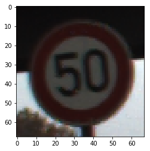


    ==========
    True :2
    predicted:2.0
    
    I think that belongs to class: 2.0
    ==========


    ==========
    True :1
    predicted:1.0
    
    I think that belongs to class: 1.0
    ==========


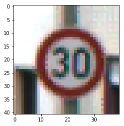


    ==========
    True :1
    predicted:1.0
    
    I think that belongs to class: 1.0
    ==========


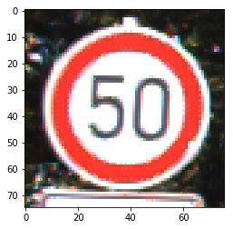


    ==========
    True :2
    predicted:2.0
    
    I think that belongs to class: 2.0
    ==========


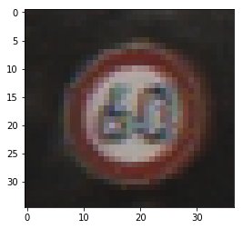


    ==========
    True :3
    predicted:3.0
    
    I think that belongs to class: 3.0
    ==========


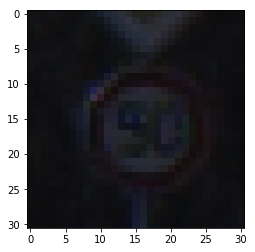


    ==========
    True :2
    predicted:2.0
    
    I think that belongs to class: 2.0
    ==========


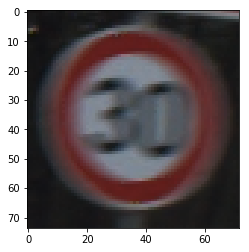


    ==========
    True :1
    predicted:5.0
    
    I think that belongs to class: 5.0
    ==========


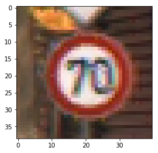


    ==========
    True :4
    predicted:4.0
    
    I think that belongs to class: 4.0
    ==========


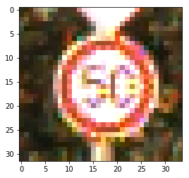


    ==========
    True :2
    predicted:2.0
    
    I think that belongs to class: 2.0
    ==========


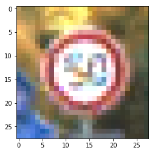


    ==========
    True :2
    predicted:2.0
    
    I think that belongs to class: 2.0
    ==========

